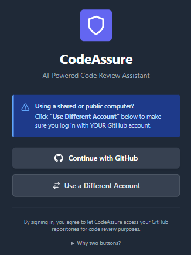
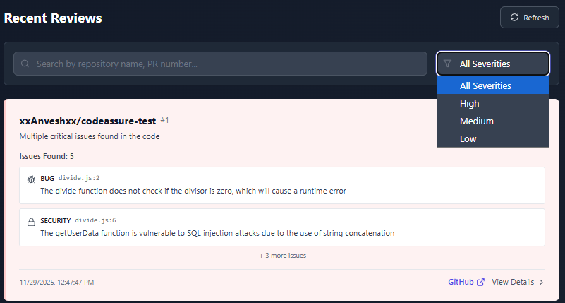
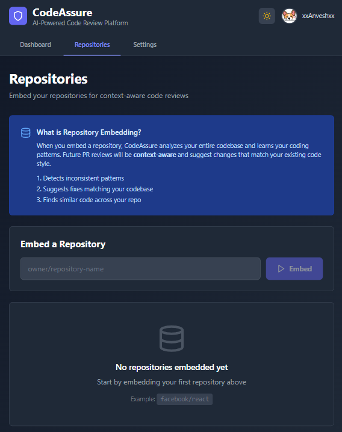
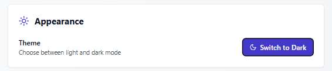

# CodeAssure
AI-powered code review assistant that analyzes pull requests using LLM technology.

# Features
- GitHub OAuth authentication
- AI code analysis with Groq (Llama 3.3 70B)
- RAG-based codebase context with Qdrant
- Real-time PR review dashboard
- Dark mode support

# Tech Stack
- Backend: FastAPI, SQLAlchemy, Groq AI
- Frontend: React, Vite, Tailwind CSS
- Database: PostgreSQL (production), SQLite (dev)
- Vector DB: Qdrant

# Screenshots
1. Login:

2. Dashboard:

3. Filter Feature:

4. Triggering manual review on a PULL REQUEST from the website:

5. Repository page(when using RAG):

6. Setting page:

7. Light Mode/Dark Mode:

